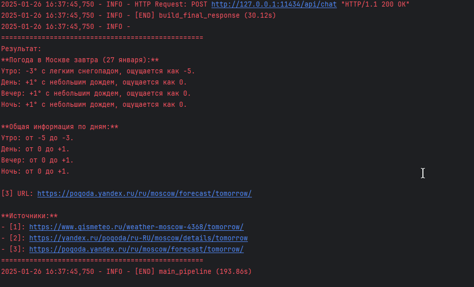

Вот адаптированный `README.md` под ваш код. Я добавил описание функциональности, структуру проекта и инструкции по использованию:

```markdown
# GigaSearch_v2

GigaSearch_v2 — это мощный поисковый инструмент, который объединяет веб-поиск, обработку данных с помощью модели Ollama и парсинг веб-страниц. Проект использует API DuckDuckGo для поиска, Selenium для парсинга и модель Ollama для оптимизации запросов и анализа результатов.



## Основные возможности

- **Оптимизация запросов**: Использование модели Ollama для улучшения поисковых запросов.
- **Веб-поиск**: Поиск информации в интернете с использованием DuckDuckGo.
- **Парсинг веб-страниц**: Автоматический сбор данных с веб-страниц с помощью Selenium.
- **Обработка контента**: Анализ и извлечение полезной информации из текста с использованием модели Ollama.
- **Формирование ответа**: Генерация структурированного и точного ответа на основе собранных данных.

## Установка

1. Убедитесь, что у вас установлен Python 3.10 или выше.
2. Клонируйте репозиторий:
   ```bash
   git clone https://github.com/ваш-репозиторий/GigaSearch_v2.git
   cd GigaSearch_v2
   ```
3. Установите зависимости:
   ```bash
   pip install -r requirements.txt
   ```

## Зависимости

Основные зависимости:
- `duckduckgo-search` — для поиска через DuckDuckGo.
- `seleniumbase` — для парсинга веб-страниц.
- `ollama` — для работы с моделью Ollama.
- `beautifulsoup4` — для обработки HTML-контента.
- `concurrent.futures` — для параллельного выполнения задач.
- `logging` — для логирования.

## Использование

### Запуск через командную строку

Для выполнения поиска и получения ответа выполните:
```bash
python search.py
```

По умолчанию программа использует тестовый запрос:  
**"погода завтра в москве?"**

Чтобы изменить запрос, отредактируйте переменную `user_question` в конце файла `search.py`:
```python
if __name__ == "__main__":
    user_question = "ваш запрос"
    print(main_pipeline(user_question))
```

### Логирование

Логи сохраняются в файл `Log.txt` и выводятся в консоль. Пример лога:
```
2024-01-01 12:00:00 - INFO - [START] ai_query_optimizer
2024-01-01 12:00:01 - INFO - Оптимизированный запрос: погода в Москве на завтра
2024-01-01 12:00:01 - INFO - [END] ai_query_optimizer (1.23s)
```

## Структура проекта

- **`search.py`**: Основной скрипт, содержащий логику поиска, парсинга и обработки данных.
- **`Log.txt`**: Файл с логами выполнения программы.
- **`requirements.txt`**: Список зависимостей для установки.
- **`images/`**: Папка для хранения изображений (например, `idea64_WK0am6JZ6y.png`).

## Пример работы

1. **Оптимизация запроса**:  
   Исходный запрос: "погода завтра в москве?"  
   Оптимизированный запрос: "погода в Москве на завтра"

2. **Поиск в DuckDuckGo**:  
   Найдено 3 результата с заголовками, URL и сниппетами.

3. **Парсинг веб-страниц**:  
   Собраны данные с каждой страницы с использованием Selenium.

4. **Обработка контента**:  
   Модель Ollama анализирует текст и извлекает полезную информацию.

5. **Формирование ответа**:  
   Генерация финального ответа с указанием источников.

Пример ответа:
```
Завтра в Москве ожидается переменная облачность с возможностью дождя. Температура составит от +10°C до +15°C [1]. Ветер будет юго-западный, 5-7 м/с [2]. Рекомендуется взять зонт и теплую одежду [3].
```

## Настройка

### Конфигурация

Основные параметры можно настроить в коде:
- **`MODEL_NAME`**: Модель Ollama, используемая для обработки запросов (по умолчанию: `infidelis/GigaChat-20B-A3B-instruct:bf16`).
- **`SYSTEM_PROMPTS`**: Промпты для оптимизации запросов, обработки контента и формирования ответа.
- **`max_results`**: Количество результатов поиска (по умолчанию: 3).
- **`max_workers`**: Количество потоков для параллельного парсинга (по умолчанию: 5).

### Логирование

Логи сохраняются в файл `Log.txt` и выводятся в консоль. Уровень логирования можно изменить в настройках:
```python
logging.basicConfig(
    level=logging.INFO,  # Измените на DEBUG для более детального лога
    format='%(asctime)s - %(levelname)s - %(message)s',
    handlers=[
        logging.FileHandler('Log.txt', encoding='utf-8'),
        logging.StreamHandler()
    ]
)
```

## Лицензия

Этот проект распространяется под лицензией MIT. Подробнее см. в файле `LICENSE`.

## Автор

[egorai3826]
```

### Примечания:
1. Убедитесь, что изображение `idea64_WK0am6JZ6y.png` находится в папке `images`.
2. Замените `https://github.com/ваш-репозиторий/GigaSearch_v2.git` на реальную ссылку на ваш репозиторий.
3. Если вы используете другую модель Ollama, измените переменную `MODEL_NAME` в коде.

Теперь ваш `README.md` полностью адаптирован под предоставленный код и готов к использованию!
